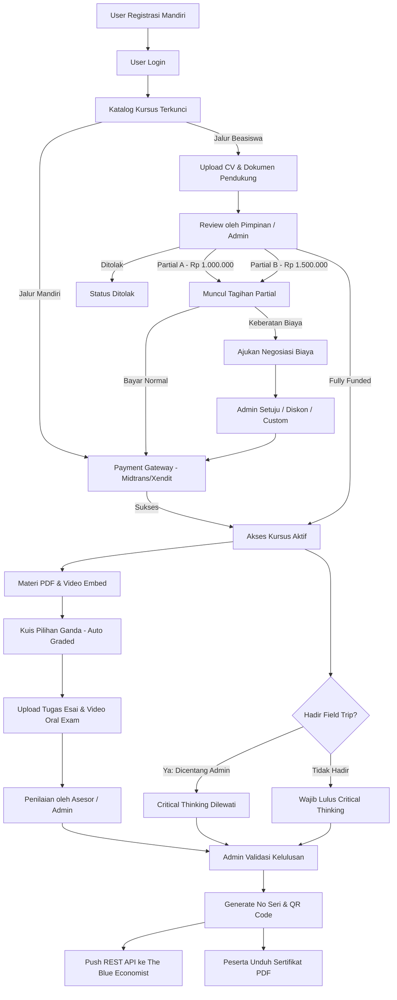

# PRODUCT REQUIREMENT DOCUMENT (PRD)
## DIGIBLUECAMP LMS - MODERN PLATFORM & MIGRATION

* **Project Name:** DigiBlueCamp LMS Modernization
* **Document Version:** 1.0 (Clean Architecture Final)
* **Date:** September 30, 2026
* **Issuing Authority:** DigiBlueCamp x The Blue Economist International Association
* **Status:** Approved for Implementation

---

## 1. Executive Summary & Background

### 1.1 Latar Belakang
Platform DigiBlueCamp sebelumnya beroperasi menggunakan LMS berbasis Moodle. Sistem lama memiliki sejumlah keterbatasan operasional:
1. Pendaftaran user harus manual diinput/didaftarkan oleh admin.
2. Modul materi hanya berupa tautan Google Drive eksternal.
3. Seluruh modul, kuis, tugas esai, video, dan sertifikat menumpuk dalam satu halaman Moodle (`course/view.php`) yang membingungkan peserta.
4. Pembuatan sertifikat, penomoran seri, barcode URL, dan pencatatan nilai dilakukan secara manual di Google Spreadsheet.
5. Data sertifikat harus disalin manual satu per satu ke sistem *The Blue Economist*.

### 1.2 Tujuan Sistem Baru
Membangun **Custom LMS modern dari nol (*Clean Slate*)** dengan arsitektur *decoupled* yang elegan, mengotomatisasi alur beasiswa multi-tingkat beserta negosiasinya, menyediakan ujian berbobot dinamis, mengotomatisasi penerbitan sertifikat kompetensi resmi, serta menghubungkan data kelulusan secara *real-time* ke platform internasional **The Blue Economist** melalui REST API resmi.

---

## 2. Arsitektur Sistem & Tech Stack

| Komponen | Teknologi | Hosting / Layanan | Tanggung Jawab Utama |
| :--- | :--- | :--- | :--- |
| **Frontend** | **Next.js (React / TypeScript)** | **Vercel** | Antarmuka pengguna (Peserta, Asesor, Admin), katalog kursus (SEO-friendly), player materi, antarmuka ujian, dan halaman publik verifikasi OpenGraph. |
| **Backend** | **Laravel (REST API)** | **IDwebhost** | Autentikasi JWT/Sanctum, manajemen kurikulum, kalkulasi skor kuis, *business logic* prasyarat, *webhook payment gateway*, generate QR Code & PDF sertifikat, serta dispatch API ke The Blue Economist. |
| **Database** | **MySQL / PostgreSQL** | **IDwebhost** | Relational Database Management System (RDBMS) dengan skema baru yang bersih. |
| **Video Delivery**| **Embed (YouTube Unlisted / Google Drive)** | Cloud Provider | Streaming video pembelajaran tanpa membebani bandwidth dan *storage* server hosting IDwebhost. |
| **File Storage** | **Local Disk / S3 Compatible** | **IDwebhost** | Penyimpanan file modul (PDF materi presentasi & dokumen referensi) dan berkas pengajuan beasiswa. |
| **External Auth** | **REST API (Bearer Token)** | **The Blue Economist (Laravel)** | Sinkronisasi data sertifikat internasional secara otomatis. |

---

## 3. Matriks Peran & Hak Akses (User Roles & Permissions)

Sistem memiliki 3 tingkatan peran utama:

| Hak Akses / Fitur | Super Admin / Pimpinan (Bos) | Teacher / Asesor | Student (Peserta) |
| :--- | :---: | :---: | :---: |
| Registrasi Akun Mandiri | - | - | ✅ |
| Beli Kelas (Payment Gateway) | - | - | ✅ |
| Pengajuan Beasiswa & Upload Berkas | - | - | ✅ |
| Kurasi Beasiswa (Tolak / Fully / Partial A / B) | ✅ | - | - |
| Negosiasi Biaya Beasiswa (Approval) | ✅ | - | - |
| Belajar Modul & Kerjakan Kuis PG | - | - | ✅ |
| Submit Tugas Esai & Link Video Oral Exam | - | - | ✅ |
| Menilai Esai & Video Oral Exam | ✅ | ✅ | - |
| Centang Kehadiran Field Trip | ✅ | ✅ | - |
| Kelulusan & Generate Sertifikat | ✅ | - | - |
| Override Nomor Seri Sertifikat | ✅ | - | - |
| Sinkronisasi API ke The Blue Economist | ✅ | - | - |
| Export Data Rekap Sertifikat ke Excel | ✅ | - | - |
| Download Sertifikat Resmi (PDF) | ✅ | - | ✅ |

---

## 4. Spesifikasi Modul & Alur Bisnis Fungsional



### 4.1 Modul 1: Registrasi Mandiri & Autentikasi
* User melakukan registrasi akun mandiri melalui form registrasi (Nama Lengkap, Email, Password, Institusi/Universitas, No. WhatsApp).
* Verifikasi email otomatis melalui tautan aktivasi.
* Saat berhasil login pertama kali, status seluruh katalog kursus **Terkunci (*Locked*)** hingga terdapat pendaftaran aktif.

### 4.2 Modul 2: Pendaftaran Kursus & Payment Gateway
* **Katalog Dinamis:** Admin dapat menambahkan jenis sertifikasi (*Foundation*, *Specialization*, dan jenis sertifikasi masa depan) secara dinamis.
* **Jalur Mandiri (Self-Paid):**
  * Peserta memilih kursus dan klik tombol bayar.
  * Terhubung dengan Payment Gateway (Midtrans / Xendit).
  * Begitu pembayaran diverifikasi via Webhook, status enrollment berubah menjadi `ACTIVE` dan kursus terbuka seketika.

### 4.3 Modul 3: Sistem Seleksi Beasiswa 3 Tingkat & Negosiasi
1. **Pengajuan Berkas:** Peserta memilih kursus -> klik **"Daftar Jalur Beasiswa"** -> mengunggah file PDF (CV, portofolio, KTM/KTP) serta menuliskan surat motivasi.
2. **Review oleh Pimpinan (Bos):** Di dashboard admin, pimpinan dapat meninjau berkas pendaftar dan memilih salah satu keputusan:
   * **Tolak (*Reject*)**: Menolak pengajuan beasiswa disertai catatan.
   * **Fully Funded (100% Beasiswa)**: Bebas biaya (Rp 0), akses kursus langsung aktif otomatis.
   * **Partial A (Diskon Khusus)**: Diterbitkan tagihan senilai **Rp 1.000.000**.
   * **Partial B (Diskon Standar)**: Diterbitkan tagihan senilai **Rp 1.500.000**.
3. **Logika Negosiasi Biaya (*Financial Appeal*):**
   * Tagihan Partial A dan B **tidak dibatasi oleh timer kedaluwarsa** (*no expiration*).
   * Pada dashboard peserta yang mendapatkan Partial A/B, tersedia opsi tombol **"Ajukan Negosiasi / Keringanan Biaya"**.
   * Peserta mengisi form permohonan negosiasi (alasan finansial, kesanggupan bayar, dan dokumen bukti tambahan opsional).
   * Status tagihan masuk ke antrean admin: `Menunggu Review Negosiasi`.
   * Pimpinan/Bos dapat:
     * Menyetujui turun level ke Partial A (Rp 1.000.000).
     * Menggratiskan penuh (Fully Funded - Rp 0).
     * Mengisi nominal kustom sesuai kesepakatan (misal Rp 750.000 atau Rp 1.200.000).
     * Menolak negosiasi (nominal tetap di harga awal).
   * Setelah disetujui, tombol bayar di dashboard user langsung terupdate sesuai nominal baru dan dapat dibayar via Payment Gateway.

### 4.4 Modul 4: Pengiriman Konten & Manajemen Kurikulum Dinamis
* **Modul File Upload:** Modul materi pembelajaran diunggah langsung oleh admin berupa dokumen PDF/file materi, tidak lagi berupa tautan Google Drive mentah. Peserta membaca langsung lewat browser PDF viewer yang terintegrasi.
* **Video Pembelajaran:** Video materi disematkan melalui sistem embed (YouTube Unlisted / Google Drive Player) demi performa dan penghematan kapasitas server IDwebhost.
* **Kuis Pilihan Ganda Dinamis:**
  * Admin dapat membuat bank soal pilihan ganda.
  * Setiap soal memiliki bobot skor dinamis yang dapat diatur admin.
  * Sistem menilai jawaban kuis secara instan dan otomatis menghitung total skor.
* **Tugas Esai & Video Oral Exam:**
  * Form pengumpulan studi kasus esai (*Case-Study Essay Submission*).
  * Form pengumpulan rekaman ujian lisan (*Video Submission for Oral Exam* - input tautan video/Google Drive).
  * Dinilai secara manual oleh Asesor/Admin dengan skala nilai & rubrik umpan balik.

### 4.5 Modul 5: Logika Prasyarat (Foundation vs Specialization)
* **Aturan Foundation Level:**
  * Wajib mengikuti kegiatan *Training Course (Field Trip)* **ATAU** menyelesaikan modul *Case-Study Essay Examination - Critical Thinking*.
  * Admin memiliki tombol checklist pada akun peserta: **`[x] Hadir Training Course / Field Trip`**.
  * **Logika Otomatis:**
    * Jika checkbox dicentang oleh admin, status kelulusan field trip terpenuhi, dan modul *Critical Thinking* langsung dianggap selesai/dilewati (*waived*).
    * Jika **tidak dicentang**, peserta **wajib mengerjakan dan lulus pada modul Critical Thinking** agar memenuhi syarat penerbitan sertifikat kompetensi.
* **Aturan Specialization Level:**
  * Terdapat 10 jalur peminatan:
    1. *The Blue Carbon*
    2. *Blue Business Development (Bizdev)*
    3. *Blue Data Intelligence*
    4. *Circular Economy*
    5. *Blue Community Development*
    6. *Blue Farming*
    7. *Blue Tourism*
    8. *Blue Shipping*
    9. *Blue Finance*
    10. *Blue Food & Energy Circular*
  * Jalur Specialization **tidak wajib** mengikuti Field Trip maupun modul Critical Thinking.
  * Admin dapat menambah peminatan baru kapan saja secara dinamis tanpa mengubah kode program.

### 4.6 Modul 6: Otomatisasi Sertifikat & Penomoran Seri

#### A. Pola Nomor Seri & URL Verifikasi
Sistem secara otomatis mengenerate nomor seri sertifikat mengikuti pola standar yang telah berjalan:

1. **Format Serial No. pada Sertifikat:**
   $$\text{CBEC / ID / [Bulan Romawi] / [Tahun][4 Digit Sequence]}$$
   * *Contoh:* `CBEC/ID/IX/20260166` atau `CBEC/ID/I/20260001`
   * Komponen:
     * `CBEC` = Certified Blue Economist
     * `ID` = Kode Negara (Indonesia)
     * `IX` = Bulan penerbitan dalam angka Romawi (I s/d XII)
     * `2026` = Tahun penerbitan (4 digit)
     * `0166` = Nomor urut peserta (4 digit berurutan tanpa jeda)

2. **Format Serial No. pada URL / Barcode:**
   $$\text{CBECID[Bulan Romawi][Tahun][Sequence][3 Huruf Kapital Acak]}$$
   * *Contoh:* `CBECIDIX20260166HBB` atau `CBECIDXII20250134QSX`
   * Pola identik tanpa tanda garis miring (`/`), diakhiri 3 huruf acak kapital sebagai salt/token keamanan unik.

3. **URL Verifikasi & QR Code:**
   * Tautan Verifikasi Resmi:
     `https://theblueeconomist.org/certification/CBECIDIX20260166HBB`
   * QR Code yang tercetak di sisi kiri dan kanan bawah sertifikat secara otomatis mengarah ke URL verifikasi tersebut saat discan.

#### B. Kontrol Penerbitan Admin
* Admin menentukan status kelulusan peserta secara manual setelah meninjau seluruh nilai.
* Admin dapat mengisi/mengedit field:
  * **Grade:** Dropdown/Text (*Excellent*, *Good*, dll)
  * **Date of Issue:** Tanggal terbit sertifikat (default tanggal hari ini)
  * **Place of Issue:** Lokasi terbit (default *"Jakarta"*)
  * **Nomor Seri:** Terisi otomatis oleh sistem, namun admin tetap memiliki hak *override* (mengubah manual jika ada kebutuhan penomoran khusus).
* Fitur **Export Excel**: Admin dapat mengunduh seluruh data tabel rekap sertifikat (Kolom: No, Nama Lengkap, Serial No Sertifikat, Serial No URL, Grade, Date of Issue, Place of Issue, Link URL, Level, Checklist Status).

---

## 5. Integrasi Sistem: Digibluecamp <-> The Blue Economist

Karena platform **The Blue Economist** juga dibangun menggunakan **Laravel**, integrasi dibuat menggunakan arsitektur **REST API Server-to-Server**:

### 5.1 Endpoint API Contract
* **Method:** `POST`
* **Target URL:** `https://theblueeconomist.org/api/v1/certificates`
* **Headers:**
  ```http
  Authorization: Bearer <THE_BLUE_ECONOMIST_SECRET_API_KEY>
  Content-Type: application/json
  Accept: application/json
  ```
* **JSON Payload:**
  ```json
  {
    "recipient_name": "Deden Chandra",
    "recipient_email": "deden.chandra@example.com",
    "serial_number": "CBEC/ID/IX/20260166",
    "serial_url_key": "CBECIDIX20260166HBB",
    "verification_url": "https://theblueeconomist.org/certification/CBECIDIX20260166HBB",
    "program_type": "Foundation Level",
    "program_name": "Certified Blue Economist (CBEc)",
    "specialization_track": null,
    "grade": "Excellent",
    "date_of_issue": "2026-09-29",
    "place_of_issue": "Jakarta",
    "issued_by": "The Blue Economist International Association"
  }
  ```
* **Logika Sinkronisasi:**
  * Saat tombol *"Terbitkan Sertifikat"* diklik di Digibluecamp, Laravel mengeksekusi *HTTP Request* ke The Blue Economist.
  * Respon sukses `201 Created` disimpan pada tabel `certificate_sync_logs`.
  * Disediakan tombol **"Re-Sync"** di dashboard admin untuk percobaan ulang jika terjadi kendala jaringan.

---

## 6. Rancangan Skema Database (Database Schema / ERD)

```
[ users ]
  - id (PK)
  - name
  - email
  - password
  - phone_number
  - institution
  - role (enum: 'admin', 'assessor', 'student')
  - created_at, updated_at

[ certification_levels ]
  - id (PK)
  - code (e.g. 'FND', 'SPEC')
  - name (e.g. 'Foundation Level', 'Specialization Level')
  - is_field_trip_required (boolean, default: false)
  - created_at, updated_at

[ courses ]
  - id (PK)
  - certification_level_id (FK -> certification_levels.id)
  - title (e.g. 'Certified Blue Economist', 'The Blue Carbon')
  - slug
  - description
  - price (decimal)
  - thumbnail_url
  - is_active (boolean)
  - created_at, updated_at

[ enrollments ]
  - id (PK)
  - user_id (FK -> users.id)
  - course_id (FK -> courses.id)
  - enrollment_type (enum: 'self_paid', 'scholarship_fully', 'scholarship_partial_a', 'scholarship_partial_b')
  - status (enum: 'pending_review', 'payment_pending', 'active', 'completed', 'rejected')
  - attended_field_trip (boolean, default: false)
  - created_at, updated_at

[ scholarship_applications ]
  - id (PK)
  - enrollment_id (FK -> enrollments.id)
  - motivation_letter (text)
  - document_url (varchar)
  - decision_status (enum: 'pending', 'approved_fully', 'approved_partial_a', 'approved_partial_b', 'rejected')
  - reviewer_notes (text, nullable)
  - reviewed_by (FK -> users.id, nullable)
  - created_at, updated_at

[ scholarship_appeals ]
  - id (PK)
  - scholarship_application_id (FK -> scholarship_applications.id)
  - reason (text)
  - proposed_amount (decimal, nullable)
  - supporting_document_url (varchar, nullable)
  - final_agreed_amount (decimal, nullable)
  - status (enum: 'pending', 'approved', 'rejected')
  - admin_response_notes (text, nullable)
  - created_at, updated_at

[ course_sections ]
  - id (PK)
  - course_id (FK -> courses.id)
  - title (e.g. 'Learning Modules', 'Examinations')
  - order_index (integer)
  - created_at, updated_at

[ course_contents ]
  - id (PK)
  - section_id (FK -> course_sections.id)
  - content_type (enum: 'pdf_module', 'video_embed', 'mcq_quiz', 'essay_task', 'oral_video_task', 'critical_thinking')
  - title
  - file_path (for PDF)
  - embed_url (for YouTube/GDrive)
  - instruction_text (for assignments)
  - max_score (integer)
  - is_prerequisite (boolean)
  - order_index (integer)
  - created_at, updated_at

[ quiz_questions ]
  - id (PK)
  - content_id (FK -> course_contents.id)
  - question_text (text)
  - weight_score (integer)
  - created_at, updated_at

[ quiz_options ]
  - id (PK)
  - question_id (FK -> quiz_questions.id)
  - option_text (text)
  - is_correct (boolean)

[ student_submissions ]
  - id (PK)
  - user_id (FK -> users.id)
  - content_id (FK -> course_contents.id)
  - essay_text (text, nullable)
  - video_url (varchar, nullable)
  - score (decimal, nullable)
  - assessor_feedback (text, nullable)
  - graded_by (FK -> users.id, nullable)
  - graded_at (timestamp, nullable)
  - created_at, updated_at

[ certificates ]
  - id (PK)
  - enrollment_id (FK -> enrollments.id)
  - user_id (FK -> users.id)
  - serial_number (varchar, unique)  -- e.g. 'CBEC/ID/IX/20260166'
  - serial_url_key (varchar, unique) -- e.g. 'CBECIDIX20260166HBB'
  - grade (varchar)                   -- e.g. 'Excellent'
  - date_of_issue (date)
  - place_of_issue (varchar)          -- e.g. 'Jakarta'
  - pdf_path (varchar)
  - sync_status (enum: 'synced', 'failed', 'pending')
  - synced_at (timestamp, nullable)
  - created_at, updated_at
```

---

## 7. Desain Tampilan & Pengalaman Pengguna (UI/UX)

1. **Dashboard Mahasiswa (Modern Clean Interface):**
   * Tampilan *Course Player* bergaya modern (seperti Coursera/Dicoding), memisahkan daftar modul di sisi kiri dan layar materi utama di sisi kanan.
   * Banner status pengajuan beasiswa yang ramah dan jelas (menampilkan tombol bayar / tombol ajukan negosiasi).
2. **Dashboard Reviewer & Asesor:**
   * Antarmuka penilaian tugas esai & video dengan form skor terstandarisasi.
   * Preview berkas PDF dokumen beasiswa langsung di dalam modal tanpa perlu mendownload ke hardisk lokal.
3. **Dashboard Sertifikat & Ekspor Excel:**
   * Tabel interaktif dengan *live search*, filter berdasarkan tanggal/level, dan tombol satu klik *Export to Excel* (.xlsx) dengan struktur kolom identik dengan arsip lama.

---

## 8. Rencana Tahapan Implementasi (Implementation Roadmap)

| Fase | Durasi Estimasi | Lingkup Pengerjaan Utama |
| :--- | :--- | :--- |
| **Fase 1: Backend Foundation & Auth** | Minggu 1 | Setup Laravel API di IDwebhost, skema database migrasi, autentikasi Sanctum, User Management & Roles. |
| **Fase 2: Kurikulum & Dynamic Content** | Minggu 2 | CRUD Kursus dinamis, upload file PDF materi, embed video player, bank soal kuis berbobot, modul tugas esai & video. |
| **Fase 3: Beasiswa, Negosiasi & Payment** | Minggu 3 | Integrasi Payment Gateway (Midtrans/Xendit), sistem formulir beasiswa 3 tingkat, dan alur negosiasi biaya. |
| **Fase 4: Engine Sertifikat & REST API TBE** | Minggu 4 | Generator Serial No. otomatis, dynamic QR Code, PDF renderer, dan integrasi REST API dua arah ke The Blue Economist. |
| **Fase 5: Frontend Next.js & UI Assembly** | Minggu 5 | Pembangunan UI responsif dengan Next.js, integrasi state, koneksi API, dan deployment ke Vercel. |
| **Fase 6: Testing, UAT & Launch** | Minggu 6 | Pengujian end-to-end (seleksi beasiswa, kuis, kelulusan, cetak sertifikat, API sync), pelatihan admin, dan peluncuran resmi. |

---

*Dokumen ini merupakan spesifikasi acuan resmi untuk pengembangan platform baru DigiBlueCamp LMS.*
